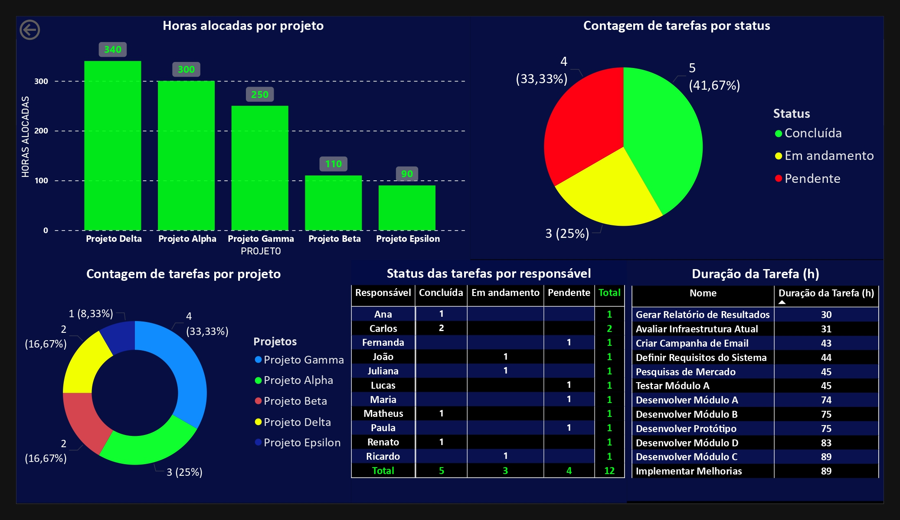

# Projects-Reports

## Descrição
Este projeto foi desenvolvido para **monitorar o andamento de projetos** utilizando **Power BI** e **SQL**. Ele fornece uma visão completa do progresso, dos recursos alocados e das tarefas envolvidas, permitindo o acompanhamento detalhado dos projetos em uma interface visual interativa.

## Funcionalidades
- **Horas alocadas por projeto**: Monitora o progresso de cada projeto, visualizando quanto tempo é gasto em cada projeto.
- **Acompanhamento de Tarefas**: Exibe o status (Concluída/Em Andamento/Pendente) de todas as tarefas existentes.
- **Contagem de tarefas por projeto**: Mostra a soma das tarefas dentro de cada projeto.
- **Status das tarefas por responsável**: Exibe o status das tarefas de cada responsável.
- **Duração da Tarefa (h) por Projeto**: Visualiza o tempo necessário para a conclusão de cada tarefa.

## Estrutura do Projeto
O projeto está organizado em:
- **Power BI**: Arquivo `.pbix` com os relatórios e dashboards interativos.
- **SQL**: Scripts SQL para criação e manipulação das tabelas utilizadas, incluindo `projetos`, `tarefas` e `recursos`.

### Tabelas
1. **Projetos**: Informações gerais de cada projeto, como data de início e fim.
2. **Recursos**: Lista de recursos humanos e horas alocadas para cada projeto.
3. **Tarefas**: Detalhes de cada tarefa, incluindo responsáveis, status e prazo.

## Pré-requisitos
- **Power BI Desktop** (ou acesso ao Power BI Service)

## Como Usar
1. **Conectar os dados ao Power BI**: Importe os dados do `.csv` para o Power BI usando as importações disponíveis.
2. **Explorar os Dashboards**: Use os relatórios e dashboards para monitorar e analisar o progresso dos projetos.

